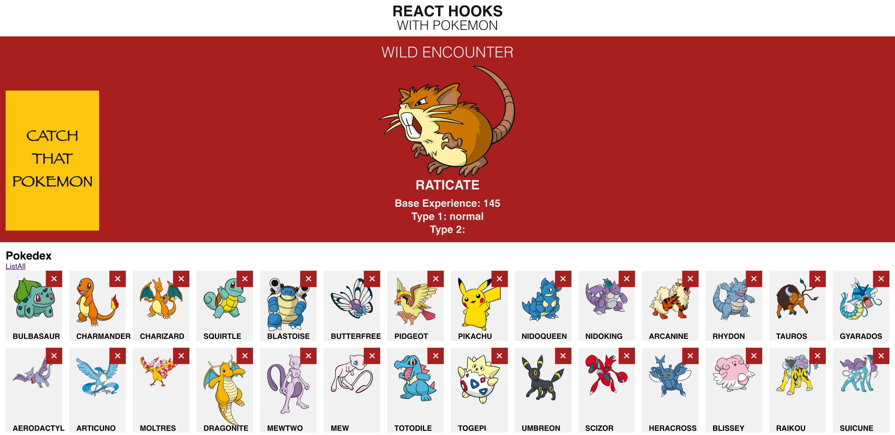

# Pokedex
Mario Hernandez

## Table of Contents

* User Story
* Technologies
* Installation
* Screenshot
* Usage
* License


# User Story: 

As a user, I want to be able to add pokemons to a pokedex and be able to delete them. I want to be able to view these pokemon after catching them. I should also be able to display information for each pokemon.

# Technologies:

HTML, CSS, JS, react.js

# Installation

To install necessary dependencies, run the following command:
​
```
npm i

npm start
```

## Screenshot





## License

© 2020 Copyright
